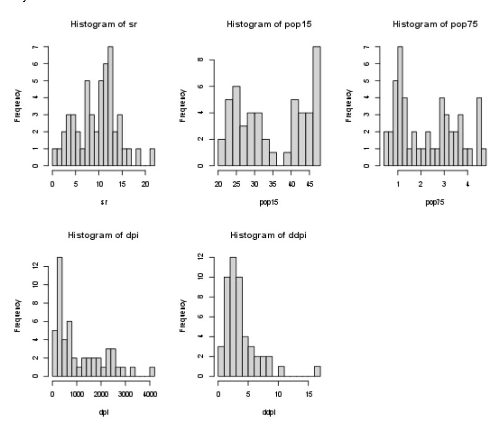
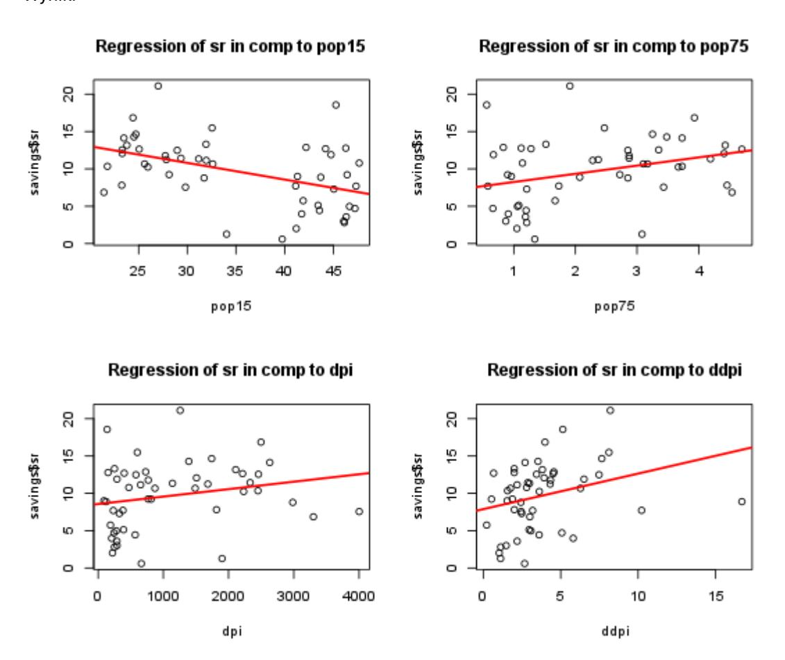
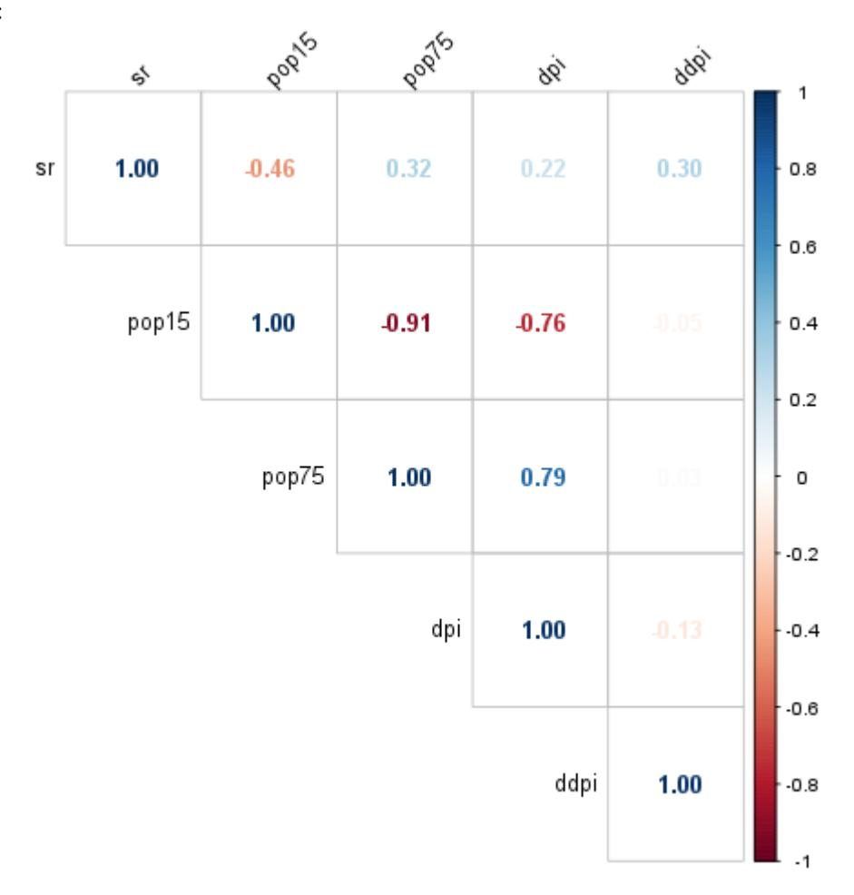
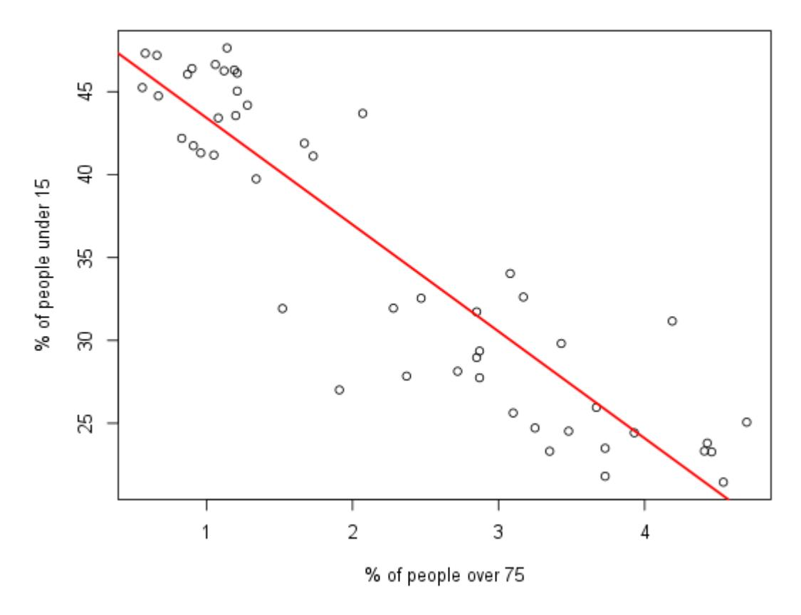
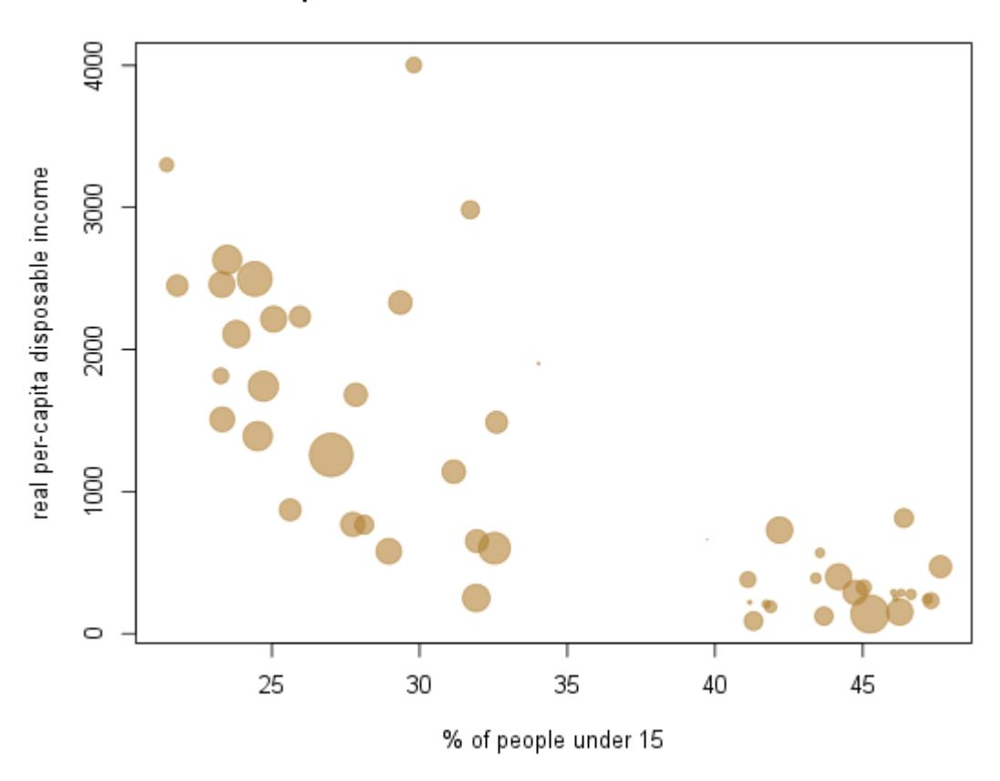
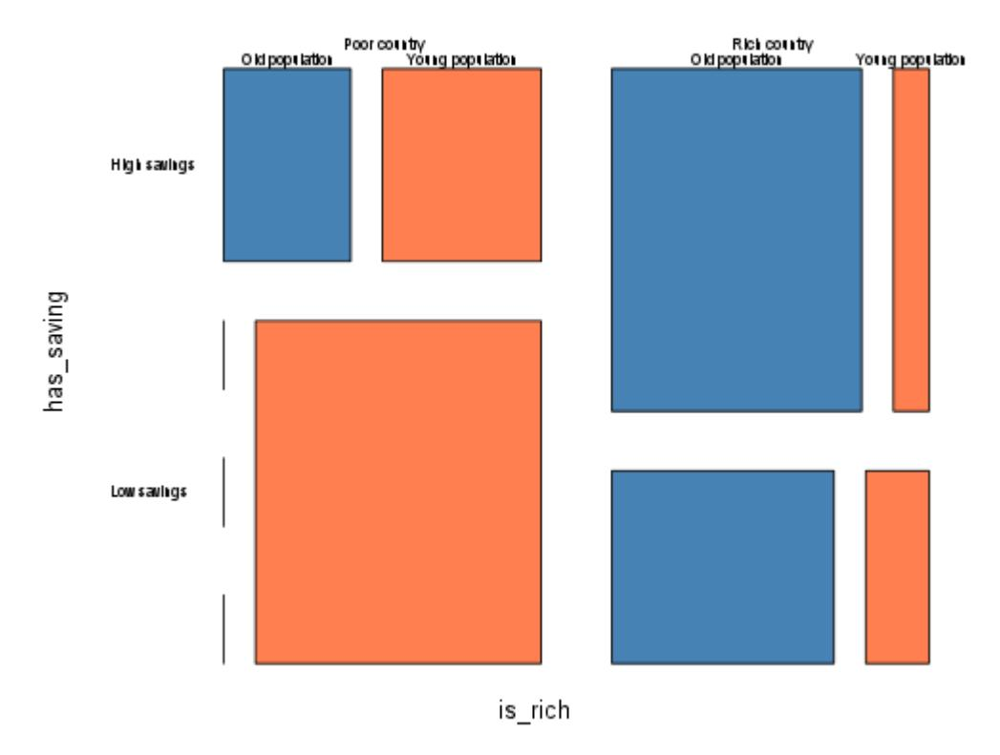
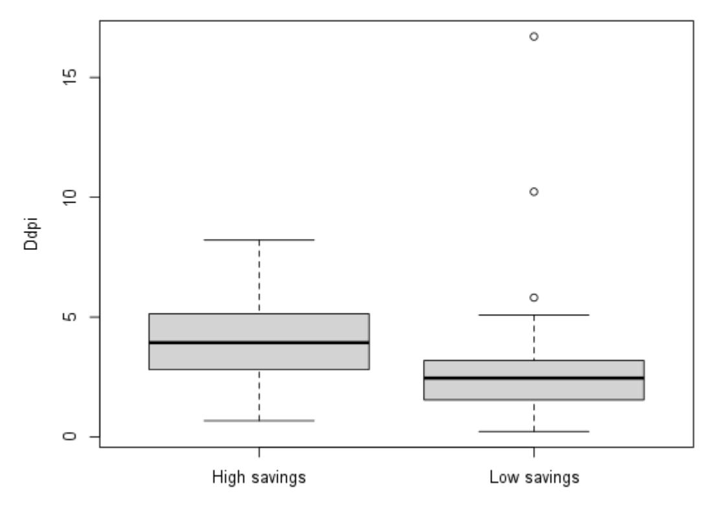

# **Analiza i wizualizacja danych**

Kod:

```
plot_numerical <- function() {
   par(mfrow = c(2, 3))
   for (col in names(savings)) {
      hist(savings[[col]], breaks = 15, main = paste("Histogram of", col), xlab = col)
   }
   par(mfrow = c(1, 1))
}
plot_numerical()</pre>
```

Wynik:



Opis:

Zmienne pop15, pop75 i ddpi są procentami co dobrze pokazuje w jakich zakresach się one poruszają, potencjalnymi wartościami skrajnymi są 0 i 100. Można zauważyć potencjalne outliery, ponieważ leżą daleko od typowych wartości dla tych zmiennych, 21.1 dla wartości sr czy 4001.89 i 16.710. Aczkolwiek mogą one jedynie ukazywać odpowiednio kraj bardzo oszczędny, bogaty lub szybko rozwijający się.

# 2. Zależności między zmiennymi przyjmując, że poziom oszczędności jest zmienną objaśnianą

Kod:

```
plot_scatters <- function() {
   par(mfrow = c(2, 2))
   for (col in names(savings %>% select(-sr)))
   {
      plot(savings[[col]], savings$sr, main = paste('Regression of sr in comp to', col), xlab = col)
      abline(lm(sr ~ savings[[col]], data = savings), col = 'red', lwd = 2)
   }
   par(mfrow = c(1, 1))
}
plot_scatters()
```

Wynik:



Opis:

Widać że oszczędności są proporcjonalne do wszystkich zmiennych oprócz procentu osób poniżej 15 roku życia, do którego są odwrotnie proporcjonalne. Można założyć największą liniową proporcjonalność z procentami ludności w danych grupach. Dla reszty zmiennych dane są mocno rozrzucone względem prostej.

# 3. Korelacja między wartościami

### Kod:

```
M <- cor(savings)
library(corrplot)
corrplot(M, method = "number", type = "upper", tl.col = "black", tl.srt = 45)</pre>
```

### Wynik:



### Opis:

Widzimy że największą korelację między sobą posiadają procenty wystąpień ludności. Wartość dpi jest również z nimi stosunkowo mocno skorelowana.

Jest to zachowanie normalne im więcej niepracujących poniżej 15 roku tym niższe dpi i odwrotnie im więcej pracujących tym wyższe.

4. Związek między procentem osób poniżej 15 roku życia a powyżej 75 roku życia.

Kod:

```
 plot(savings$pop75, savings$pop15, main = paste('Regression of pop15 in comp to 
pop75'), xlab = "% of people over 75", ylab = "% of people under 15")
 abline(lm(savings$pop15 ~ savings$pop75, data = savings), col = 'red', lwd = 2)
plot_pops_comp()
```

Wynik:



#### Opis:

Widać że wartości procentowe są odwrotnie proporcjonalne do siebie, im większa ilość jednej zmiennej tym mniejsza drugiej. Ukazuje to dobrze wiek społeczeństwa, jeszcze lepiej ukazuje to powiązanie z dpi. Pokrywa się to również z wysoką ujemną korelacją między nimi.

# 5. Zależności między procentem osób poniżej 15 roku życia a dpi

Kod:

```
size <- LifeCycleSavings$sr/5
plot(LifeCycleSavings$pop15, LifeCycleSavings$dpi,
 ylab = 'real per-capita disposable income',
 xlab = '% of people under 15',
 main = 'Comparision beetween % of under 15 with RPDI ',
 pch = 19,
 col = rgb(0.7, 0.5, 0.2, alpha = 0.6),
 cex = size)
```

Wynik:



## Opis:

Po raz kolejny bardzo dobrze zobrazowany jest, że im więcej ludzi poniżej 15 roku życia tym niższe jest dpi , co pokazano i omówiono przy wykresie obrazującym korelacje. Można także zauważyć, że im wyższy procent tym jest więcej krajów z niższymi oszczędnościami. Wiele z nich ma oszczędności podobne do krajów z niższym procentem, aczkolwiek tam jest to bardziej stabilne oraz występują wartości ogólnie większe.

# 6. Mozaika obrazująca stosunki dla poszczególnych grup.

Kod:

```
savings$is_young <- ifelse(savings$pop15>median(savings$pop15), "Young 
population", "Old population")
savings$is_rich <- ifelse(savings$dpi>median(savings$dpi),"Rich country", "Poor 
country")
savings" )
 main = "Comparision of age, saving and RPDI",
 color = c("steelblue","coral"),
 las=1)
```

Wynik:



#### Opis:

Widać, że praktycznie całość krajów które mają zarówno niskie zarobki jak i oszczędności to kraje z procentem osób młodych powyżej mediany. Odwrotnie możemy zauważyć taka samą zależność, w krajach bogatych z dużymi oszczędnościami, występuje stosunkowo starsze społeczeństwo. Ciekawym widokiem jest fakt, że większy udział krajów z dużymi oszczędnościami wśród bogatych krajów dotyczy populacji młodszej.

# 7. Zależność między poziomem oszczędności a przyrostem dpi

Kod:

```
boxplot(ddpi ~ has_saving, data = savings,
 main="Influence of growth in dpi to savings",
 xlab = "Has saving above median?",
 ylab = "Ddpi"
```

Wynik:



### Opis:

Dla krajów z większym przyrostem dpi , można zauważyć wyższy poziom oszczędności, może to pokazywać, że przyrost pieniędzy pozwala zgromadzić większe oszczędności. Potencjalnie może to symbolizować różnice w ludności między tymi krajami, gdzie w krajach szybciej rozwijających się może być inne podejście społeczeństwa do oszczędności.